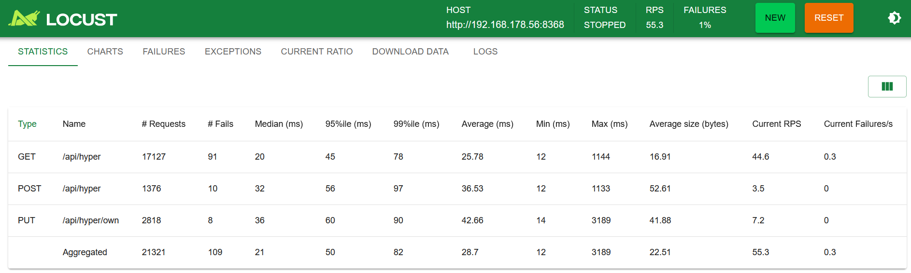

# Hyperstore iOS

## Context

This is a playground project to see how some typical web app can be served by a smartphone. You may have an old iPhone available, don't really want to throw it away but also don't really need it and things may be no longer working as they should (broken display, bad battery, camera issues). Instead of buying a Raspberry Pi for hobby / playground projects consider using using it instead, all nowadays smartphones have good CPU/RAM/storage in there and are optimized for low power consumption.

Recommendation of course is a proper firewall / access control and only use this for for non-critical applications.

## App

The app is based on my [hyperstore](https://github.com/janpetzold/hyperstore) app, a very rudimentary commerce application supporting reading, buying and adding stock items. This has been re-implemented in (basic) Python. SQLite is used as database.

## Boundary conditions

Generally the way a smartphone works (especially iPhone) is not optimized for any kind of server processing due to the heavy limitations of background threads / operations. I did all my tests on an iPhone 7 (using last iOS release 15.1.8 for this phone). IPhone 6 should also work. Beside this consider the following aspects:

- on iOS you're generally limited to Python, I did not find good programming support / tooling for any other language (except native Swift / Objective C of course). I used [Pyto](https://pyto.app/) Lite for this.
- the app/IDE needs to be running and the screen must not be turned off (can be defined in system settings), this essentially wastes battery capacity but since there are no (proper) background threads this is the only way to keep the server alive
- due to the screen being on permanently it is easy to continuously print status / relevant information to the command-line output

# Setup
Pyto IDE needs to be installed via AppStore and requires iOS 12. This just needs standard Python 3.x. The easiest way to sync files I found was using [Apple Devices app](https://support.apple.com/en-gb/guide/devices-windows/mchl923c1147/1.5/windows/10) via "Files" menu. This enables you to simply "upload" the `hyperstore.py` to the Pyto directory and execute it via Play button in Pyto.

To perform benchmarking install locust via

    pip3 install locust

Start locust via

    locust -f locustfile.py

# Benchmarks
For the iPhone 7 using the code in this repo I found 50 parallel users / around 30 requests per second perfectly stable. Duplicating this led to (reproducible) error rates around 1%. Response times of the (unoptimized) HTTP erver remained pretty good. Soo this result overview from Locust:

## TODO

- measure battery/power consumption
- evaluate impact of "better" web server like Flask